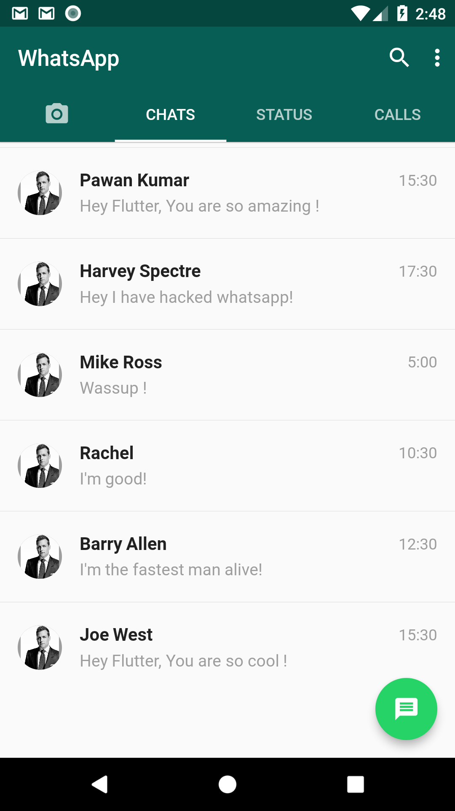
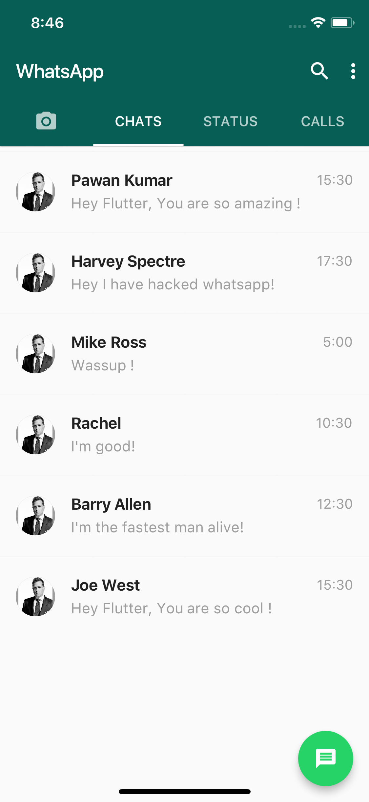

# WazUp

Building a WhatsApp Clone in Flutter.

### Show some :heart: and star the repo to support the project

### Screenshots

 

### Created & Maintained By

[Roger Van Wyk](https://github.com/roger-devhub) 

# License

## Getting Started

For help getting started with Flutter, view our online
[documentation](https://flutter.io/).
